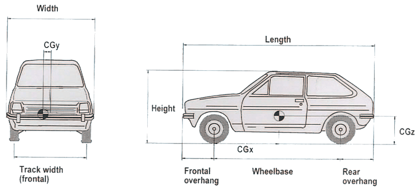

# Contents

**Click on link for quick view:**

1. [Data overview](#data_overview)
      - 1.1 [Fixing Car Data](#fixing_car)
      
2. [Car Data Visualization](#car_viz)  
      - 2.1 [Car Length VS Car Width](#carlw)  
      - 2.2 [Horsepoer and Car price](#carhp)  
      - 2.3 [Horsepower VS MPG in highway](#carmh)  
      - 2.4 [Horsepower VS MPG in city](#carch)  
      - 2.5 [Drive wheel VS Weight](#cardw)  
      - 2.6 [Drive wheel VS Weight based on aspiration](#cardwa) 
      - 2.7 [Number of car per company](#carnb)  
      - 2.8 [Car average price based on car company](#carpc)  
      - 2.9 [Top 5 expensive car company](#cartpc)  
      - 2.10 [Car Engine size density plot](#card)
      - 2.10 [Price density plot based on car body type](#carpl)
3. [Conclusion](#car_con)  
      
> Nice TOC

```{r,echo=FALSE,warning=FALSE}
library(tidyverse)
```


# 1.Data overview<a name="data_overview"></a>
 


##### The data set contains information of **car ID,symboling,Car Name,fuel type,aspiration,door number,car body,drive wheel,engine location,wheel base,car length,car width,car height,curb weight,engine type,cylinder number,engine size,fuel system,bore ratio,stroke,compression ratio,horse power,peak rpm,city mpg,high waympg,price** There is 205 rows and 26 Columns.The instances here illustrate different car brands such as BMW, Mercedes, Audie etc.


```{r,echo=FALSE}
car <-read_delim("data/CarPrice_Assignment.csv")
head(car,10)
```


### 1.1 Fixing car data <a name="fixing_car"></a>

##### 1.1.1 First of all I've renamed the column **carId** to **brandname** and take the brand name from car name by extracting the first word of the name.

```{r,echo=FALSE}
car_data<-car %>%
  rename(brandname=car_ID)%>%
  mutate(brandname=word(CarName, 1))
head(car_data,10)
```
#####  1.1.2 Afterwards I've duplicate listings and cleaned the columns. As example Some brand name of car are mixed by captilization and short from of name or spelling error.Like in row 10, maxda->mazda


```{r,echo=FALSE}

message("Before Cleaning  we have 28 brand name")
count(car_data,brandname)
car_s<-car_data %>%
  mutate(brandname = ifelse(as.character(brandname) == "maxda","mazda",as.character(brandname)))%>%
  mutate(brandname =ifelse(as.character(brandname) == "vokswagen","volkswagen",as.character(brandname)))%>%
  mutate(brandname =ifelse(as.character(brandname) == "toyouta","toyota",as.character(brandname)))%>%
  mutate(brandname =ifelse(as.character(brandname) == "Nissan","nissan",as.character(brandname)))%>%
  mutate(brandname =ifelse(as.character(brandname) == "vw","volkswagen",as.character(brandname)))%>%
  mutate(brandname =ifelse(as.character(brandname) == "porcshce","porsche",as.character(brandname)))


message("After Cleaning  we have 22 brand name")
count(car_s,brandname)
```

> I'm counting this as a table - 

# 2.Car Data Visualization<a name="car_viz"></a>
     


### 2.1 From graph we can observe that lengthy car has more doors and  wagon bodytypes of car are lengthy compare to others.<a name="carlw"></a>
```{r,echo=FALSE}
car_data%>%
ggplot()+
aes(x = carwidth,
y = carlength,
colour = carbody) +
geom_point(aes(shape=doornumber),size=3,alpha=0.7) +  
geom_smooth(method = "lm",formula='y~x',se=FALSE)+ scale_colour_viridis_d()+
labs(x= "Car width" ,y="Car length",
     caption="Different Shape represent the car Door Numbers ",
     title="Car Length VS Car Width ",
     subtitle = "Dimensions for five different car body(Convertible,hardtop,hatchback,sedan,wagon)")+
theme(plot.caption = element_text(face = "italic"))

```


### 2.2 This visualization represnts that there is a positive co-relation between price and horsepower.<a name="carhp"></a>
```{r,echo=FALSE}
car_data%>%
ggplot()+
aes(x = horsepower,
y = price) +
geom_point(aes(shape=carbody,colour=carbody),size=3,alpha=0.7) +  
geom_smooth(method = "lm",formula='y~x')+ scale_colour_viridis_d()+
labs(x= "Car horsepower" ,y="Car Price",
     title="Horsepoer and Car price ",
     subtitle = "Dimensions for five different car body(Convertible,hardtop,hatchback,sedan,wagon)")+
theme(plot.caption = element_text(face = "italic"))

```


### 2.3 we can observe that which car has lower horsepower that has higher millage per gallon another ovservation is front-wheel drive cars get better mileage.<a name="carmh"></a>


```{r, warning=FALSE,echo=FALSE}
car_s %>%
ggplot(aes(y = highwaympg,
x = horsepower,
fill = drivewheel,
colour = drivewheel)) +
geom_violin(alpha = 0.1, trim = FALSE) +
geom_point(position = position_jitterdodge(),
alpha = 0.5,
show.legend = FALSE)+
labs(x= "Horse Power" ,y="Miles per Gallon in Highway",
     title="Horsepower VS MPG in highway ",
     subtitle = "Dimensions for three different car wheel (rwd,fwd,4wd)")+
theme(plot.caption = element_text(face = "italic"))
```

### 2.4 For city it illustrates same thing as before.<a name="carch"></a>
```{r, warning=FALSE,echo=FALSE}
car_s %>%
ggplot(aes(y = citympg,
x = horsepower,
fill = drivewheel,
colour = drivewheel)) +
geom_violin(alpha = 0.1, trim = FALSE) +
geom_point(position = position_jitterdodge(),
alpha = 0.5,
show.legend = FALSE)+
labs(x= "Horse Power" ,y="Miles per Gallon in Cities Road",
     title="Horsepower VS MPG in city ",
     subtitle = "Dimensions for three different car wheel (rwd,fwd,4wd)")+
theme(plot.caption = element_text(face = "italic"))
```


    
### 2.5 In previos graph we see that front-wheel drive cars get better mileage.From this graph we try to find out the reason why front-wheel drive car has better milage and this visualization represents that most of the time, front-wheel drive cars weight is less than that of a rear-wheel or 4wd car.<a name="cardw"></a>

> I would recommend shorter headings, here something like "Mileage by drive" and the rest of the heading as actual text

```{r,echo=FALSE}
car_s %>%
ggplot(aes(x = drivewheel,y=curbweight,
fill = drivewheel,
colour = drivewheel))+ 
geom_boxplot(alpha = 0.1) +
geom_point(position = position_jitterdodge(dodge.width = 0),
alpha = 0.5)+
labs(x= "Drive Wheel" ,y="Car weight",
     title="Drive wheel VS Weight ",
     subtitle = "Three different car wheel (rwd,fwd,4wd)")+
theme(plot.caption = element_text(face = "italic"))
```


### 2.6 Visulization of box plot presents that turbocharger engine are heavier hence those car are more heavier.<a name="cardwa"></a>


```{r,echo=FALSE}
car_s %>%
ggplot(aes(x = drivewheel,y=curbweight,
fill = drivewheel,
# for violin contours and dots
colour = aspiration))+ 
geom_boxplot(alpha = 0.1) +
geom_point(position = position_jitterdodge(dodge.width = 0),
alpha = 0.5)+
labs(x= "Drive Wheel" ,y="Car weight",
     title="Drive wheel VS Weight ",
     subtitle = "Based on aspiration")+
theme(plot.caption = element_text(face = "italic"))
```

> Not quite sure why you include boxplots when you're using the (better imho) violin plots above. But again useful illustration.
   
### 2.7 Number of car per company in this dataset also provide information about the fuel type of car.<a name="carnb"></a>


```{r,echo=FALSE}
library(forcats)
car_s %>%
ggplot(aes(y = fct_infreq(brandname),fill=fueltype)) +
geom_bar() +
scale_x_continuous(expand = c(0, NA)) +
theme_minimal(14) +
theme(panel.ontop = TRUE,
panel.grid.major.y = element_blank())+
  labs(x= "Count" ,y="Brand Name/Company Name",
     title="Number of car per company in this data set ",
     subtitle = "Dimension for type of fuel")+
theme(plot.caption = element_text(face = "italic"))

```

    
### 2.8 Car average price based on car company.<a name="carpc"></a>

```{r,echo=FALSE}
car_s %>%
    group_by(brandname) %>%
    summarize(Avgprice = mean(price, na.rm=TRUE))%>%
ggplot()+
      geom_col(aes(x=Avgprice, y=brandname,fill=brandname))+
             scale_x_continuous()+
  theme_minimal(15) +
theme(panel.ontop = TRUE,
panel.grid.major.y = element_blank())+
  labs(y="Car Brand Name/Car Company Name",x="Car Price",
       title="Car Average price based on company ")+
theme(plot.caption = element_text(face = "italic"))
```

> Here the legend is redundant and takes away space, so should be removed.
   
### 2.9 Top 5 expensive car company from the previous visualization.<a name="cartpc"></a>

```{r,echo=FALSE}
car_s %>%
  group_by(brandname) %>%
    summarize(Avgprice = mean(price, na.rm=TRUE))%>%
  mutate(carcompany = fct_lump(brandname, n = 5,w=Avgprice)) %>%
  group_by(carcompany)%>%
   mutate(carcompany = fct_reorder(carcompany,-Avgprice)) %>%
  arrange(desc(Avgprice))%>%
  ggplot()+
      geom_col(aes(x=carcompany, y=Avgprice,fill=brandname))+
  scale_y_continuous()+
    labs(x="Car Brand Name/Car Company Name",y="Car Price",
       title="Top 5 expensive car company with others")+
theme(plot.caption = element_text(face = "italic"))

```
 
 
### 2.10 This visualization illustrates that most of the time light engine located in fronal of the car.<a name="card"></a>
```{r,echo=FALSE}
car_s %>%
ggplot(aes(x = enginesize,
fill = enginelocation,
colour = enginelocation))+
  geom_density(alpha=0.7)+
  labs(x= "Car Engine Size" ,
     title="Car Engine size density plot ",
     subtitle = "Dimension for Engine Location")+
theme(plot.caption = element_text(face = "italic"))
```

  
### 2.11 This visualization is about price density plot based on car body type.<a name="carpl"></a>
```{r,echo=FALSE}
car_s %>%
ggplot(aes(x =price ,
fill = carbody,
color = carbody)) +
geom_density(alpha = 0.7)+
  labs(x= "Price" ,
     title="Price density plot based on car body type ",
     subtitle = "Dimension for Carbody")+
theme(plot.caption = element_text(face = "italic"))
```


<!-- ###2.1--- -->
<!-- #1.---<a name=""></a> -->
<!-- #1.---<a name=""></a> -->
<!-- #1.---<a name=""></a> -->
<!-- #1.---<a name=""></a> -->
<!-- #1.---<a name=""></a> -->
<!-- #1.---<a name=""></a> -->


<!-- #1.<a ></a> -->
<!-- #1.<a ></a> -->

<!-- Package Installation -->
<!-- knitr::opts_chunk$set(echo = TRUE, fig.width = 15, fig.height = 5) -->
<!-- ```{r} -->

<!-- library(tidyverse) -->
<!-- ``` -->
<!-- #rakibul hasan -->
<!-- jsfsdfksj j  sfklsjflksf sposkfjsdlkfjslkf -->

<!-- ###HASAN -->

<!-- ### Here is a data set of soybean. The data set is about Soybean production and use by year and country. -->

<!-- ```{r} -->
<!-- soybean_use <-read_delim("data/soybean_use.csv") -->
<!-- summary(soybean_use) -->
<!-- ``` -->

<!-- ### We are going to drop the code column. -->

<!-- ```{r} -->
<!-- soybean_use1 <-select(soybean_use,-c("code")) -->
<!-- soybean_use1 -->

<!-- ``` -->

<!-- ### We are going to calculate the toatl use of soybean. -->
<!-- ```{r} -->
<!-- soybean_use1 %>% -->
<!-- mutate(total=human_food+animal_feed+processed) -->

<!-- ``` -->


<!-- ```{r} -->
<!-- soybean_use1%>% -->
<!--    filter(entity%in%c("Bangladesh","Luxembourg","Germany","France"))%>% -->
<!-- ggplot(aes(x=year,y=human_food,fill=entity,color=entity)) +  -->
<!--   geom_line() +   -->
<!--   labs(title="Year Vs Soybean uses for human food", subtitle=" 4 different countries(Bangladesh,Luxembourg,Germany,France)", y="Soybean uses for human food ", x="year") -->
<!-- ``` -->


<!-- https://www.kaggle.com/goyalshalini93/car-data?select=CarPrice_Assignment.csv -->
<!-- ```{r} -->
<!-- car <-read_delim("data/Used_Car_Price_Data.csv") -->
<!-- car -->
<!-- ``` -->
<!-- ```{r} -->
<!-- car <-read_delim("data/CarPrice_Assignment.csv") -->
<!-- summary(car) -->
<!-- ``` -->
<!-- ```{r} -->
<!-- car_data<-car %>% -->
<!--   rename(brandname=car_ID)%>% -->
<!--   mutate(brandname=word(CarName, 1)) -->
<!-- ``` -->


<!-- ```{r} -->
<!-- car_s<-car_data %>% -->
<!--   mutate(brandname = ifelse(as.character(brandname) == "maxda","mazda",as.character(brandname)))%>% -->
<!--   mutate(brandname =ifelse(as.character(brandname) == "vokswagen","volkswagen",as.character(brandname)))%>% -->
<!--   mutate(brandname =ifelse(as.character(brandname) == "toyouta","toyota",as.character(brandname)))%>% -->
<!--   mutate(brandname =ifelse(as.character(brandname) == "Nissan","nissan",as.character(brandname)))%>% -->
<!--   mutate(brandname =ifelse(as.character(brandname) == "vw","volkswagen",as.character(brandname)))%>% -->
<!--   mutate(brandname =ifelse(as.character(brandname) == "porcshce","porsche",as.character(brandname))) -->
<!-- ``` -->


<!-- ```{r} -->
<!-- car_data%>% -->
<!-- ggplot()+ -->
<!-- aes(x = carlength, -->
<!-- y = carwidth, -->
<!-- colour = carbody) + -->
<!-- geom_point(aes(shape=fueltype),size=3,alpha=0.7) +   -->
<!-- geom_smooth(method = "lm",formula='y~x',se=FALSE)+ scale_colour_viridis_d()+ -->
<!-- labs(x= "Car length (mm)" ,y="Car Width", -->
<!--      caption="Two different fueltype (GAS & Diesel)", -->
<!--      title="Car Length VS Car Width ", -->
<!--      subtitle = "Dimensions for five different car body(Convertible,hardtop,hatchback,sedan,wagon)")+ -->
<!-- theme(plot.caption = element_text(face = "italic")) -->

<!-- ``` -->
<!-- ```{r} -->
<!-- car_s -->
<!-- ``` -->


<!-- ```{r} -->


<!-- ``` -->

<!-- ```{r} -->

<!-- car_s %>% -->
<!--   ggplot()+ -->
<!--       geom_col(aes(x=brandname, y=price,fill=brandname))+ -->
<!--              scale_y_continuous()+ -->
<!--   labs(x="Car Brand Name/Car Company Name",y="Car Price") -->
<!-- ``` -->


<!-- ```{r} -->
<!-- #pivot_longer(car_s,brandname : price,names_to = "company",values_to = "totalprice")%>% -->
<!--  # ggplot(aes(x=price,color=brandname,fill=car_s))+geom_density(alpha=0.4)+labs(x="[ozone]", -->
<!--                                                                             #title="Garden's densities")+expand_limits(x=c(-5,17)) -->
<!-- ``` -->

<!-- ```{r} -->
<!-- car_s %>% -->
<!-- ggplot(aes(x =price , -->
<!-- fill = carbody, -->
<!-- color = carbody)) + -->
<!-- geom_density(alpha = 0.7) -->
<!-- ``` -->

<!-- ```{r} -->
<!-- car_s%>% -->
<!-- ggplot(aes(x = horsepower, y = highwaympg)) +  -->
<!--   geom_point(size = 2) +  -->
<!--   geom_smooth(method = lm, color = 'red4',formula = y~x) +  -->
<!--   labs(title = 'Relationship between Horsepower and Miles per gallon in cities') +  -->
<!--   xlab('Horsepower') +  -->
<!--   ylab('Miles per Gallon') + -->
<!--   theme_bw()  -->
<!-- ``` -->
<!-- ```{r} -->
<!-- car_s%>% -->
<!-- ggplot()+ -->
<!-- aes(x = horsepower, -->
<!-- y = citympg, -->
<!-- colour = fueltype) + -->
<!-- geom_point(aes(shape=fueltype),size=3,alpha=0.7) +   -->
<!-- geom_smooth(method = "lm",formula='y~x',se=FALSE)+ scale_colour_viridis_d()+ -->
<!-- labs(x= "Car length (mm)" ,y="Car Width", -->
<!--      caption="Two different fueltype (GAS & Diesel)", -->
<!--      title="Car Length VS Car Width ", -->
<!--      subtitle = "Dimensions for five different car body(Convertible,hardtop,hatchback,sedan,wagon)")+ -->
<!-- theme(plot.caption = element_text(face = "italic")) -->
<!-- ``` -->


<!-- ```{r} -->

<!-- count(car_s, brandname) %>% -->
<!-- ggplot() + -->
<!-- geom_col(aes(x = brandname, y = n,fill=brandname)) -->


<!-- ``` -->


<!-- ```{r} -->
<!-- ggplot(car_s) + -->
<!-- geom_bar(aes(y = fuelsystem, fill = drivewheel)) + -->
<!-- facet_grid(fct_lump_min(fuelsystem, 4) ~ ., -->
<!-- space = "free", scales = "free_y") + -->
<!-- labs(y = NULL) -->

<!-- ``` -->


<!-- A four-wheel drive system can be understood as a combination of the FWD system and the RWD system acting in tandem, which enables the engine to connect to and send power to all four wheels. -->

<!-- ```{r, warning=FALSE} -->
<!-- car_s %>% -->
<!-- # define aes here for both geometries -->
<!-- ggplot(aes(y = highwaympg, -->
<!-- x = horsepower, -->
<!-- fill = drivewheel, -->
<!-- # for violin contours and dots -->
<!-- colour = drivewheel -->
<!-- )) + # very transparent filling -->
<!-- geom_violin(alpha = 0.1, trim = FALSE) + -->
<!-- geom_point(position = position_jitterdodge(), -->
<!-- alpha = 0.5, -->
<!-- # don't need dots in legend -->
<!-- show.legend = TRUE) -->

<!-- ``` -->
<!-- #show this  -->

   
# 3.Conclusion<a name="car_con"></a>  
### In our Data Visualization course, I have learnt about the Grammar of Graphics,how to use ggplot2 for data visualization ,other package of R to  visualize scatter plots,basic bar charts, histograms, pie charts,violin plots, line plots,  box plots and how to further customize plots using themes.In this workshop, I try to analyse car data using those technique.By this visualization tools we can easily get a clear overview about car properties and performance with a quick view. To conclude, we can say that Data visualization is one of the useful technologies for data scientist.

Data Reference    
https://www.kaggle.com/goyalshalini93/car-data  
Image reference link     
1.https://www.researchgate.net/figure/Cars-dimensions-15_fig10_252035013     
2.https://www.scienceabc.com/innovation/what-is-a-four-wheel-drive-system-and-how-does-it-work.html     

> Good to include the links to the references and absolutely OK for an assignement but in professional context also check the license (possibily not even OK on the page you referencing this from) and be careful. 

> Great README with install instructions, very nice. 

### Thanks to Roland Krause for this helpful course

> Thanks for the nice contribution. The only really weak point is that it's about cars, not bicycles. 
